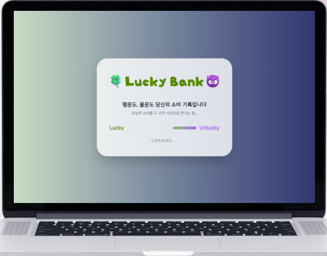
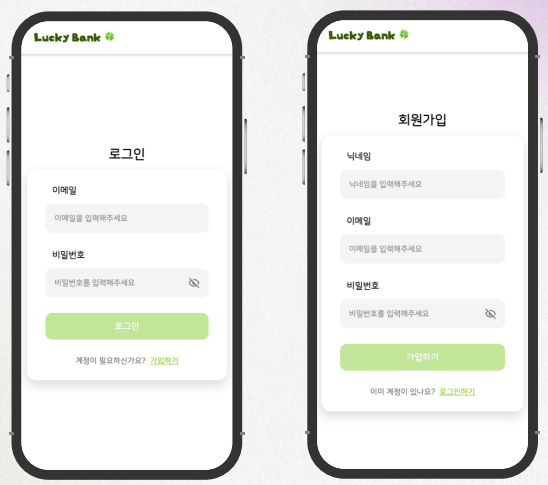
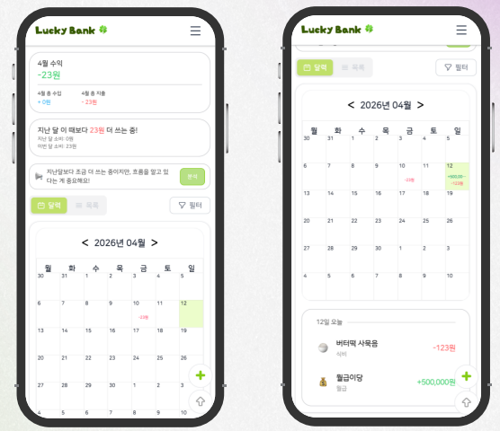
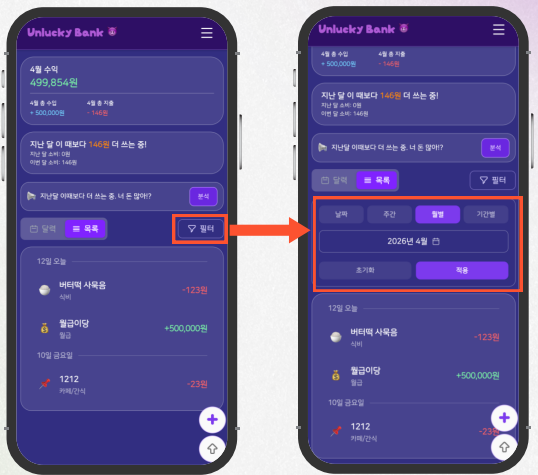
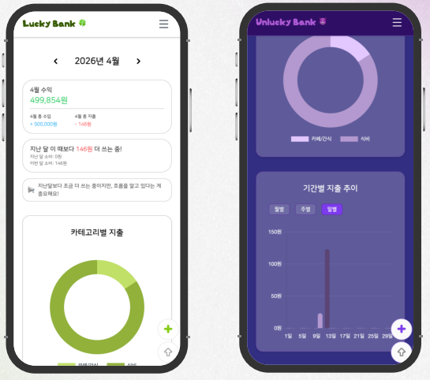
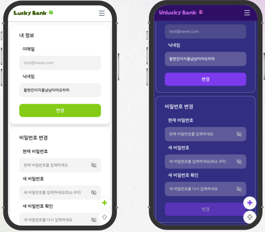

## 블랙핑크와 시민의 가계부 : 럭키/언럭키 뱅크

# 🍀 Lucky Bank & 😈 Unlucky Bank

> 단순한 소비 기록을 넘어,  
> **럭키/언럭키 피드백으로 소비 습관 변화를 유도하는 가계부 서비스**

## 📌 프로젝트 소개

**Lucky Bank & Unlucky Bank**는 사용자가 자신의 수입/지출을 기록하고,  
그 기록을 단순히 저장하는 데서 끝나지 않고  
**긍정적/부정적 톤의 피드백**을 통해 소비 습관을 더 직관적으로 인식할 수 있도록 만든 서비스입니다.

기존 가계부 서비스가 “기록” 자체에 집중했다면,  
이 프로젝트는 기록을 기반으로 사용자의 소비 패턴을 더 쉽게 이해하게 하고  
지속적인 사용과 관리로 이어질 수 있도록 설계되었습니다.

---

## 🎯 프로젝트 목표

- 사용자가 자신의 소비 패턴을 보다 쉽게 이해하도록 돕기
- 지속적인 재정 관리를 실천할 수 있도록 유도하기
- **Lucky / Unlucky**라는 컨셉 요소를 통해 서비스 사용 동기 부여하기
- 건강한 소비 습관 형성을 지원하기

---

## ✨ 차별점

### 기존 가계부 서비스

- 소비를 단순 기록하는 형태에 가까움
- 기록만으로는 사용자가 자신의 소비 습관을 인지하고 행동을 바꾸는 데 한계가 있음

### Lucky Bank & Unlucky Bank

- 단순 기록을 넘어 **투자형 피드백 요소** 도입
- 소비에 대해 **긍정적 피드백 / 경고성 피드백** 제공
- 사용자가 자신의 소비를 단순히 적는 것을 넘어  
  **직관적으로 인식하고 반응할 수 있도록 설계**

---

## 🧩 주요 기능

### 1. Splash Screen

- 앱 진입 전 사용자 기대감 상승
- 브랜드 컨셉 전달

### 2. 로그인 / 회원가입

- 사용자별 데이터 관리를 위한 개인 계정 생성

### 3. 메인 화면

- 수입 / 지출 확인 및 관리
- 총 수익 확인
- 지난달 대비 소비 확인
- 럭키 / 언럭키 피드백 제공
- 달력 및 리스트 기반 거래 내역 확인

### 4. 거래 내역 필터링

- 날짜 / 주간 / 월별 / 기간별 거래 내역 필터링

### 5. 빠른 거래 등록

- 추가 버튼을 통한 간편 입력
- 수입 / 지출 선택
- 카테고리 선택
- 상세 메모 작성

### 6. 모드 변경 / 로그아웃

- 토글을 통한 자유로운 Lucky / Unlucky 모드 전환
- 설정 페이지 이동
- 로그아웃 기능 제공

### 7. 통계

- 차트를 통한 소비 데이터 시각화
- 수입 / 지출 및 순수익 확인
- Lucky / Unlucky 피드백
- 카테고리별 지출 분석
- 기간별 지출 추이 확인 (일 / 주 / 월)

### 8. 설정

- 회원 정보 수정
- 닉네임 수정
- 비밀번호 변경

---

## 🛠 Tech Stack

### Frontend

- Vue
- Tailwind CSS
- Chart.js
- Vercel

### Server

- JSON Server
- Railway

---

## 👥 Team

| 이름   | 역할                                                                 |
| ------ | -------------------------------------------------------------------- |
| 황현선 | 기획 / 자료 제작, 로그인 / 회원가입 / 회원정보수정 페이지 담당       |
| 이채린 | 기획 / 디자인, 메인페이지(상단 카드 3개) / 알림 담당                 |
| 장재한 | 기획 / 디자인, 메인페이지(달력) 담당, JSON Server 배포               |
| 김혜진 | 기획 / 디자인, 스플래시 스크린 / 통계 페이지 담당                    |
| 김도현 | 기획 / 디자인, 메인페이지(리스트) / 레이아웃(헤더, dto, 테이블) 담당 |

---

## 🖥 서비스 화면

### Splash

- 앱 진입 전 브랜드 컨셉을 강조하는 스플래시 화면

### Login & Signup

- 앱 진입 후 로그인, 회원가입 화면

### Main

- 캘린더 기반 거래 내역 확인
- 수입/지출 요약
- Lucky / Unlucky 모드별 UI 제공

### Statistics

- 차트 기반 소비 분석
- 카테고리별 / 기간별 시각화

### Setting

- 회원 정보 수정
- 닉네임 / 비밀번호 변경

---

## 🚀 Deploy

- **서비스 링크**: https://blackpink-account-book.vercel.app/

---

## 💡 기대 효과

이 서비스는 단순한 가계부를 넘어,  
사용자가 소비 데이터를 **더 쉽게 인식하고**,  
재미 요소가 가미된 피드백을 통해  
**지속적으로 사용하고 싶은 서비스 경험**을 제공하는 것을 목표로 합니다.

---

## 📂 프로젝트 성격

KB IT’s Your Life 7기 스켈레톤 프로젝트로 진행된 팀 프로젝트이며,  
가계부라는 익숙한 서비스에 **브랜딩 요소와 감정형 피드백**을 접목해  
기존 기록형 서비스와 차별화된 경험을 제공하고자 했습니다.

---

## Github

  
<strong>깃 협업 규칙</strong>

   

### 1. 이슈

- 저장소 초기 세팅

#### Issue Type

- `Feat`: 새로운 기능 추가
- `Bug`: 버그 수정
- `Docs`: 문서 수정
- `Refactor`: 코드 리팩토링
- `Style`: 코드 형식 변경 (기능 변경 없는 경우)
- `Test`: 테스트 코드 추가/수정

### 2. 브랜치

- `feat/#이슈번호`

### 3. 커밋

- 예시: `docs: 작업 설명`

#### Commit Type

- `feat` : 새로운 기능 추가
- `fix` : 버그 수정, 기능 수정
- `docs` : 문서 수정
- `refactor` : 코드 리팩토링 (변수명 수정 등)
- `test` : 테스트 코드, 리팩토링 테스트 코드 추가
- `style` : 코드 스타일 변경, 코드 자체 변경이 없는 경우
- `remove` : 파일 또는 코드, 리소스 제거
- `resource` : 이미지 리소스, prefab 등의 코드와 상관없는 리소스 추가

### 4. PR

- 예시: `[docs] xxx 기능 개발`

